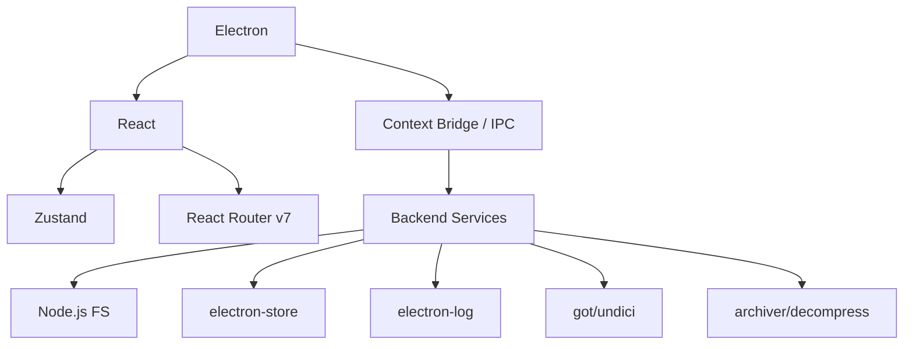

# Technology Stack

## Objective
Define the technology stack for the Entropic State Mod Manager and provide explicit justifications for each choice.

## Responsibility
This document governs all technology choices, library additions, and framework usages within the project. 

## Scope
Covers frontend, backend (main process), tooling, architecture paradigms, folder structures, and specific libraries.

## Technology Stack with Justifications

### Framework Frontend: React 19
- **Justification**: Largest ecosystem, best tooling, excellent TypeScript support, massive community, most AI agents are trained on React code.
- **Alternatives considered**: Vue 3 (smaller ecosystem), Svelte (less mature for desktop), Solid (too new).

### Language: TypeScript 5.x (strict mode)
- **Justification**: Type safety catches bugs early, better IDE support, self-documenting code, strict mode prevents any-abuse.
- **Config**: `strict: true`, `noUncheckedIndexedAccess: true`, `noImplicitReturns: true`.

### Runtime: Node.js (bundled with Electron)
- **Justification**: Required by Electron, provides file system access, native module support.

### Desktop Framework: Electron 33+
- **Justification**: Most mature desktop framework for web technologies, battle-tested (VS Code, Discord, Slack), excellent docs, strong community.
- **Alternatives considered**: Tauri (Rust backend complexity, less mature), Neutralinojs (limited), NW.js (less maintained).

### UI Library: No external UI library - Custom components with Vanilla CSS
- **Justification**: The design is highly specific (True Dark Desktop), no UI library matches it exactly, custom components are simpler to maintain for this scale, avoids dependency bloat.
- **CSS approach**: CSS custom properties (variables) for theming, CSS modules for scoping, no Tailwind (overkill for desktop app).

### State Management: Zustand
- **Justification**: Minimal boilerplate, TypeScript-first, no providers needed, simple API, perfect for medium-sized apps, works great with React.
- **Alternatives considered**: Redux Toolkit (too much boilerplate), Jotai (too atomic for this), MobX (complex).

### Routing: React Router v7
- **Justification**: Industry standard, well-documented, supports nested routes, works well with Electron.

### Build System: Electron Forge with Vite
- **Justification**: Official Electron build tool, Vite plugin for fast HMR, handles packaging and distribution.
- **Config**: `electron-forge` with `@electron-forge/plugin-vite`.

### Package Manager: pnpm
- **Justification**: Faster than npm, disk-efficient, strict dependency resolution, workspace support.

### Key Libraries
- `electron-store`: Simple JSON config persistence.
- `electron-log`: Cross-platform logging.
- `zod`: Runtime schema validation.
- `adm-zip` (pending): Archive extraction for mod packages.

### Configuration Format: JSON
- **Justification**: Native to JavaScript/TypeScript, human-readable, easy to parse, no external parser needed.
- **Files**: `config.json` (app settings), `games.json` (game registry), `mods.json` (per-game mod registry).

## Architecture Strategies

### IPC Strategy
- **Approach**: Electron `contextBridge` + `ipcMain`/`ipcRenderer` with typed channels.
- **Justification**: Security (contextIsolation), type safety, clear API boundary.

### Backend Organization
- **Approach**: Service-based with dependency injection via constructor.
- **Services**: FileSystemService, GameService, ModService, DownloadService, ConfigService, LogService.

### Frontend Organization
- **Approach**: Feature-based folder structure.
- **Features**: dashboard, games, mods, downloads, settings, logs.
- **Shared**: components, hooks, stores, types, utils.

## Dependency Graph


## Folder Structure
```
entropic-state/
├── src/
│   ├── main/           # Electron main process
│   │   ├── services/   # Backend services
│   │   ├── ipc/        # IPC handlers
│   │   ├── providers/  # Game providers
│   │   └── index.ts    # Main entry
│   ├── preload/        # Preload scripts
│   │   └── index.ts
│   ├── renderer/       # React frontend
│   │   ├── app/        # App shell, router
│   │   ├── features/   # Feature modules
│   │   ├── shared/     # Shared code
│   │   └── index.tsx   # Renderer entry
│   └── shared/         # Shared types between main/renderer
│       ├── types/
│       ├── constants/
│       └── schemas/
├── docs/               # This documentation
├── resources/          # App icons, assets
├── forge.config.ts     # Electron Forge config
├── vite.main.config.ts
├── vite.preload.config.ts
├── vite.renderer.config.ts
├── tsconfig.json
├── package.json
└── AGENT.md
```

## Dependencies
- Refers to concepts outlined in `01-PROJECT_CONTEXT.md`.

## Criteria for Completion
Considered complete when all primary technical decisions are documented and justified, and the folder structure is mapped.

## Next Steps
- Enforce these stack choices in implementation and code reviews.
- Outline specific architecture patterns in `03-ARCHITECTURE.md`.

## Relation to Other Documents
- Influenced by `01-PROJECT_CONTEXT.md`.
- Provides the technical foundation for all subsequent technical docs (03 through 17).
